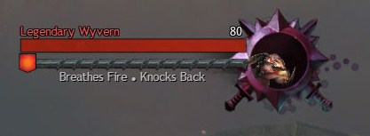

# DungeonMobSummary

DungeonMobSummary is an AddOn that shows information about what individual opponents in a Mythic+ dungeon can do without having to open a tool like MDT. It is intended to be a helpful reminder for experienced players and a gentle introduction to newer players.

Heavily inspired by the description text of NPCs from Guild Wars 2 nameplates.

